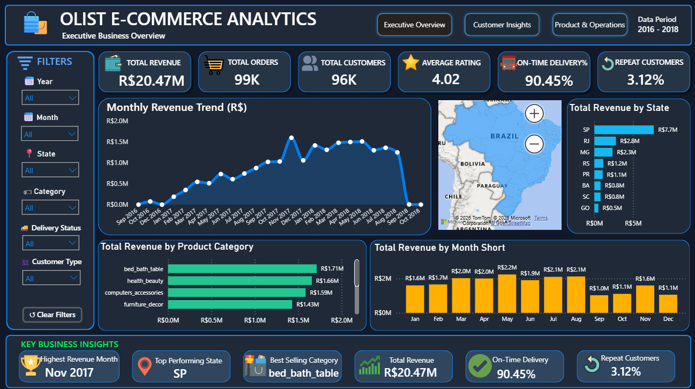
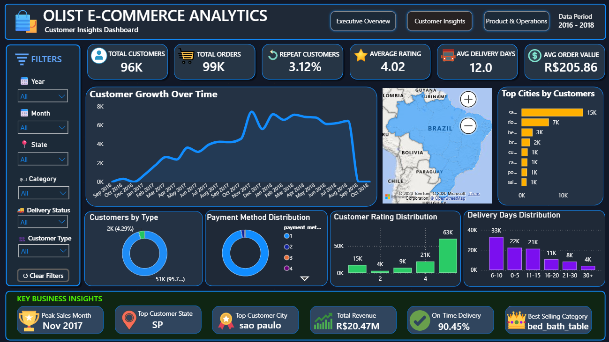
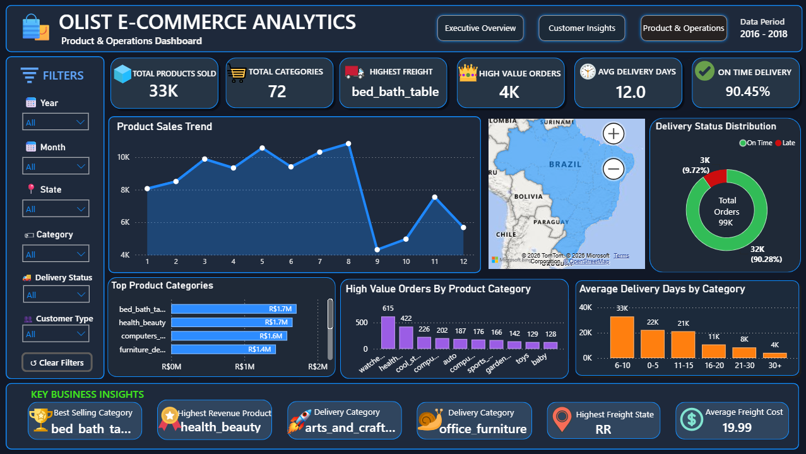

# E-Commerce Customer Behavior & Sales Analysis

A Power BI business analytics project focused on understanding e-commerce sales performance, customer behavior, product performance, and delivery operations using the Brazilian Olist e-commerce dataset.

## 📊 Project Overview

This project transforms e-commerce data into an interactive Power BI dashboard designed to provide a business-level view of:

- Sales and revenue performance
- Customer growth and behavior
- Product and category performance
- Geographic sales distribution
- Customer ratings
- Delivery performance
- Repeat-customer behavior
- High-value orders and freight analysis

The dashboard is organized into three analytical views:

1. **Executive Overview**
2. **Customer Insights**
3. **Product & Operations**

## 🎯 Business Objectives

The main objectives of this analysis are to:

- Monitor overall revenue and order performance
- Identify high-performing states, cities, and product categories
- Understand customer growth and customer characteristics
- Analyze customer ratings and repeat-customer behavior
- Evaluate delivery performance and delivery time
- Identify product categories associated with high-value orders
- Present complex e-commerce data through an easy-to-use interactive dashboard

## 🛠️ Tools & Technologies

- **Power BI** — Dashboard development and interactive visualization
- **DAX** — Measures and KPI calculations
- **Power Query** — Data transformation and preparation
- **Data Modeling** — Building relationships and analytical structure
- **Python / Jupyter Notebook** — Exploratory analysis and supporting data analysis
- **Data Visualization** — Business-focused charts, KPIs, maps, and trends

## 📌 Key Dashboard Metrics

The dashboard provides the following overall metrics from the analyzed dataset:

| KPI | Value |
|---|---:|
| Total Revenue | R$20.47M |
| Total Orders | 99K |
| Total Customers | 96K |
| Average Rating | 4.02 |
| On-Time Delivery | 90.45% |
| Repeat Customers | 3.12% |
| Average Delivery Days | 12.0 |
| Average Order Value | R$205.86 |

## 📈 Dashboard Pages

### 1. Executive Overview

Provides a high-level view of business performance, including:

- Total revenue
- Total orders
- Total customers
- Average rating
- On-time delivery
- Repeat customers
- Monthly revenue trend
- Revenue by state
- Revenue by product category
- Monthly revenue comparison



---

### 2. Customer Insights

Focuses on customer behavior and customer-level performance.

Key analysis includes:

- Customer growth over time
- Customers by type
- Payment method distribution
- Customer rating distribution
- Top cities by customers
- Delivery-day distribution
- Average order value
- Repeat-customer rate



---

### 3. Product & Operations

Focuses on product sales and operational performance.

Key analysis includes:

- Product sales trend
- Top product categories
- High-value orders by product category
- Delivery status distribution
- Average delivery days by category
- Freight performance
- Product and delivery-related KPIs



## 🔍 Key Business Observations

Based on the dashboard analysis:

- **São Paulo (SP)** is the leading state by revenue in the dashboard.
- **bed_bath_table** is identified as the leading product category by revenue/sales performance in the dashboard.
- **November 2017** is highlighted as the highest-revenue month.
- The dashboard reports an **on-time delivery rate of 90.45%**.
- The overall **average customer rating is 4.02**.
- The dashboard reports a **3.12% repeat-customer rate**, indicating an opportunity to further analyze customer retention and repeat purchasing.
- Delivery performance varies across delivery-time groups and product categories, providing opportunities for operational improvement.

## 🔄 Project Workflow

```text
Raw E-Commerce Data
        ↓
Data Cleaning & Transformation
        ↓
Data Modeling
        ↓
DAX Measures & KPIs
        ↓
Exploratory Analysis
        ↓
Interactive Power BI Dashboard
        ↓
Business Insights
```

## 📂 Repository Structure

```text
ecommerce-customer-behavior-sales-analysis/
│
├── Dashboard/
│   ├── Executive_Overview.png
│   ├── Customer_Insights.png
│   └── Product_Operations.png
│
├── E-Commerce Customer Behavior & Sales Analysis.ipynb
├── Olist_Ecommerce_Analytics.pbix
├── .gitattributes
├── .gitignore
└── README.md
```

## 📓 Notebook

The repository also contains the Jupyter Notebook:

**`E-Commerce Customer Behavior & Sales Analysis.ipynb`**

It provides supporting analysis and exploratory work related to the project.

## 📁 Dataset

This project uses the **Brazilian E-Commerce Public Dataset by Olist**.

The original dataset is **not included in this repository** to keep the repository lightweight. The Power BI project and dashboard screenshots are provided for portfolio and demonstration purposes.

## 🚀 How to Explore the Project

### Power BI Dashboard

1. Download `Olist_Ecommerce_Analytics.pbix`.
2. Open it using **Microsoft Power BI Desktop**.
3. Refresh the data source if required.
4. Explore the three dashboard pages and interact with the available filters.

### Notebook

Open:

`E-Commerce Customer Behavior & Sales Analysis.ipynb`

using Jupyter Notebook, JupyterLab, or a compatible notebook environment.

## 💡 Skills Demonstrated

- Business Analytics
- Data Cleaning
- Data Transformation
- Exploratory Data Analysis
- Data Modeling
- DAX
- Power Query
- KPI Development
- Data Visualization
- Dashboard Design
- Customer Analytics
- Sales Analytics
- Operational Analytics
- Business Insight Generation

## 👨‍💻 Author

**Vinay Barhate**

Aspiring Data Analyst | AI & Data Science Graduate

This project is part of my portfolio demonstrating practical skills in **Data Analytics, Power BI, SQL, Python, and Machine Learning**.
